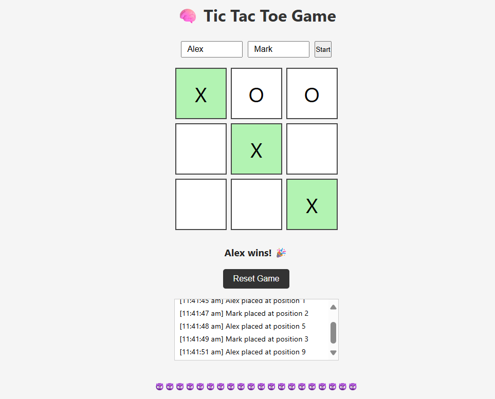

# 🎮 Tic Tac Toe – Browser Game

A simple yet elegant **Tic Tac Toe game** built using **HTML, CSS, and JavaScript**. This game allows two players to enter their names, take turns, and see real-time game status and logging.

---

## 🚀 Features

- 🔁 Two-player mode with name input
- 🎯 Real-time win/draw detection
- ✨ Animated winning cells
- 🧠 Intelligent turn switching
- 📜 Game log with timestamps
- ♻️ Reset and restart functionality
- 📱 Fully responsive layout (mobile-friendly)

---

## 🧩 Technologies Used

- **HTML5** – Semantic markup
- **CSS3** – Modern styling and animation
- **Vanilla JavaScript** – Game logic, UI updates

---

## 🛠 How to Run

 **Clone or Download** this repository.

## 📸 Screenshot

